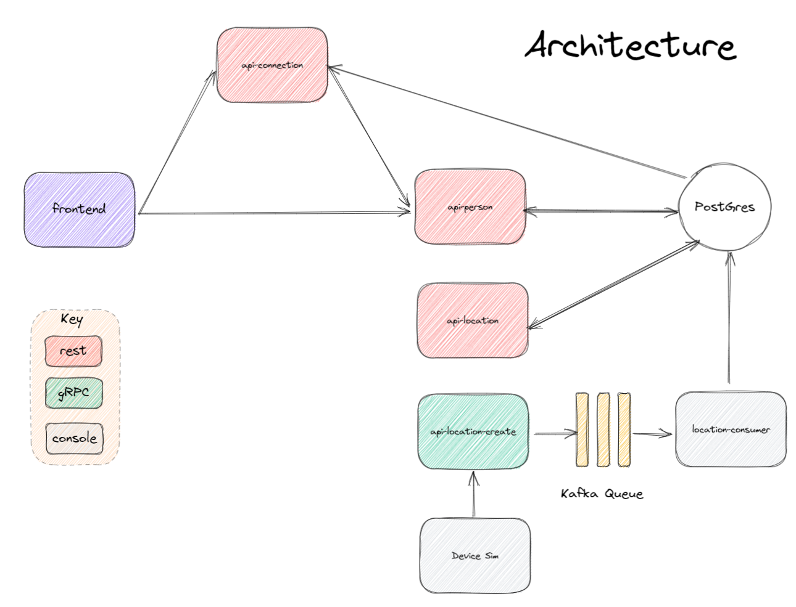

# UdaConnect
## Overview
### Background
Conferences and conventions are hotspots for making connections. Professionals in attendance often share the same interests and can make valuable business and personal connections with one another. At the same time, these events draw a large crowd and it's often hard to make these connections in the midst of all of these events' excitement and energy. To help attendees make connections, we are building the infrastructure for a service that can inform attendees if they have attended the same booths and presentations at an event.

### Goal
The aim of this project is to create a new microservices design and refactor the existing monolith app, maintaining existing functionality. 

### Key Requirements
* Cost and development time are minimized
* Services should run in containers
* Design should be able to handle ingress of a large volume of data

### Technologies
* [Flask](https://flask.palletsprojects.com/en/1.1.x/) - API webserver
* [SQLAlchemy](https://www.sqlalchemy.org/) - Database ORM
* [PostgreSQL](https://www.postgresql.org/) - Relational database
* [PostGIS](https://postgis.net/) - Spatial plug-in for PostgreSQL enabling geographic queries]
* [Docker desktop](https://docs.docker.com/desktop/kubernetes/) - Local distribution of K8s to easily develop against a local cluster
* [Helm](https://helm.sh/) A package manager for Kubernetes
* **Optional** [k9s](https://k9scli.io/) for monitoring and observability

## Running the app
The project has been set up such that you should be able to have the project up and running with Kubernetes. The app will deploy to a the "udaconnect" namespace within your chosen context.

### Prerequisites
The following is assumed to be installed and configured prior to setting up the udaconnect project.

1. Docker is installed
2. A kubernetes cluster has been setup, with kubectl configured
3. Helm is insalled and configured

### Environment Setup
To run the application, you will need a K8s cluster running locally and to interface with it via `kubectl`. 

### Steps
1. `kubectl apply -f deployment/udaconnect-namespace.yaml` - Create a namespace for the project
2. `helm repo add bitnami https://charts.bitnami.com/bitnami` to pull the latest helm repo for kafka
3. `helm install uda-kafka bitnami/kafka --namespace udaconnect` to deploy kafka
4. `kubectl apply -f deployment/db-configmap.yaml` - Set up environment variables for the pods
5. `kubectl apply -f deployment/db-secret.yaml` - Set up secrets for the pods
6. `kubectl apply -f deployment/kafka-configmap.yaml` - setup the variables for services accessing kafka
7. `kubectl apply -f deployment/postgres.yaml` - Set up a Postgres database running PostGIS
8. `kubectl apply -f deployment/udaconnect-api-location.yaml` - Set up the service and deployment for the location API
9. `kubectl apply -f deployment/udaconnect-api-person.yaml` - Set up the service and deployment for the person API
10. `kubectl apply -f deployment/udaconnect-api-location-create.yaml` - Set up the service and deployment for the location creation API
11. `kubectl apply -f deployment/udaconnect-lcoation-consumer.yaml` - Set up the service and deployment for the API
12. `kubectl apply -f deployment/udaconnect-app.yaml` - Set up the service and deployment for the web app
13. `sh scripts/run_db_command.sh <POD_NAME>` - Seed your database against the `postgres` pod. (`kubectl get pods` will give you the `POD_NAME`)


**Note**: The first time you run this project, you will need to seed the database with dummy data. Use the command `sh scripts/run_db_command.sh <POD_NAME>` against the `postgres` pod. (`kubectl get pods` will give you the `POD_NAME`). Subsequent runs of `kubectl apply` for making changes to deployments or services shouldn't require you to seed the database again!

### Verifying it Works
Once the project is up and running, you should be able to see 3 deployments and 3 services in Kubernetes:
`kubectl get pods -n udaconnect` and `kubectl get services -n udaconnect` should return all relevant pods and services

 

These pages should also load on your web browser:
* `http://localhost:30005/` - OpenAPI Documentation - location
* `http://localhost:30006/` - OpenAPI Documentation - person
* `http://localhost:30007/` - OpenAPI Documentation - connection
* `http://localhost:<port>/api/` - Base path for each API
* `http://localhost:30000/` - Frontend ReactJS Application

#### Deployment Note
You may notice the odd port numbers being served to `localhost`. [By default, Kubernetes services are only exposed to one another in an internal network](https://kubernetes.io/docs/concepts/services-networking/service/). This means that `udaconnect-app` and `udaconnect-api` can talk to one another. For us to connect to the cluster as an "outsider", we need to a way to expose these services to `localhost`.

Connections to the Kubernetes services have been set up through a [NodePort](https://kubernetes.io/docs/concepts/services-networking/service/#nodeport). (While we would use a technology like an [Ingress Controller](https://kubernetes.io/docs/concepts/services-networking/ingress-controllers/) to expose our Kubernetes services in deployment, a NodePort will suffice for development.)

## Development
### New Services
New services can be created inside of the `modules/` subfolder. You can choose to write something new with Flask, copy and rework the `modules/api` service into something new, or just create a very simple Python application.

As a reminder, each module should have:
1. `Dockerfile`
2. Its own corresponding DockerHub repository
3. `requirements.txt` for `pip` packages
4. `__init__.py`

### Docker Images
`udaconnect-app` and `udaconnect-api` use docker images from `udacity/nd064-udaconnect-app` and `udacity/nd064-udaconnect-api`. To make changes to the application, build your own Docker image and push it to your own DockerHub repository. Replace the existing container registry path with your own.

## Configs and Secrets
In `deployment/db-secret.yaml`, the secret variable is `d293aW1zb3NlY3VyZQ==`. The value is simply encoded and not encrypted -- this is ***not*** secure! Anyone can decode it to see what it is.
```bash
# Decodes the value into plaintext
echo "d293aW1zb3NlY3VyZQ==" | base64 -d

# Encodes the value to base64 encoding. K8s expects your secrets passed in with base64
echo "hotdogsfordinner" | base64
```
This is okay for development against an exclusively local environment and we want to keep the setup simple so that you can focus on the project tasks. However, in practice we should not commit our code with secret values into our repository. A CI/CD pipeline can help prevent that.

## PostgreSQL Database
The database uses a plug-in named PostGIS that supports geographic queries. It introduces `GEOMETRY` types and functions that we leverage to calculate distance between `ST_POINT`'s which represent latitude and longitude.

_You may find it helpful to be able to connect to the database_. In general, most of the database complexity is abstracted from you. The Docker container in the starter should be configured with PostGIS. Seed scripts are provided to set up the database table and some rows.
### Database Connection
While the Kubernetes service for `postgres` is running (you can use `kubectl get services` to check), you can expose the service to connect locally:
```bash
kubectl port-forward svc/postgres 5432:5432
```
This will enable you to connect to the database at `localhost`. You should then be able to connect to `postgresql://localhost:5432/geoconnections`. This is assuming you use the built-in values in the deployment config map.
### Software
To manually connect to the database, you will need software compatible with PostgreSQL.
* CLI users will find [psql](http://postgresguide.com/utilities/psql.html) to be the industry standard.
* GUI users will find [pgAdmin](https://www.pgadmin.org/) to be a popular open-source solution.

## Architecture 
Justification for the new architecture can be found [here](docs/architecture_decisions.txt)

